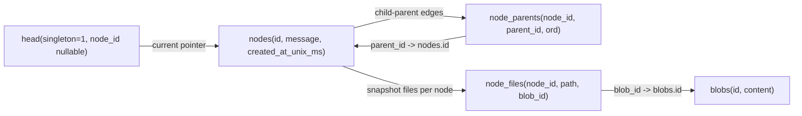
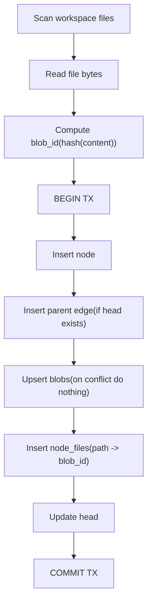
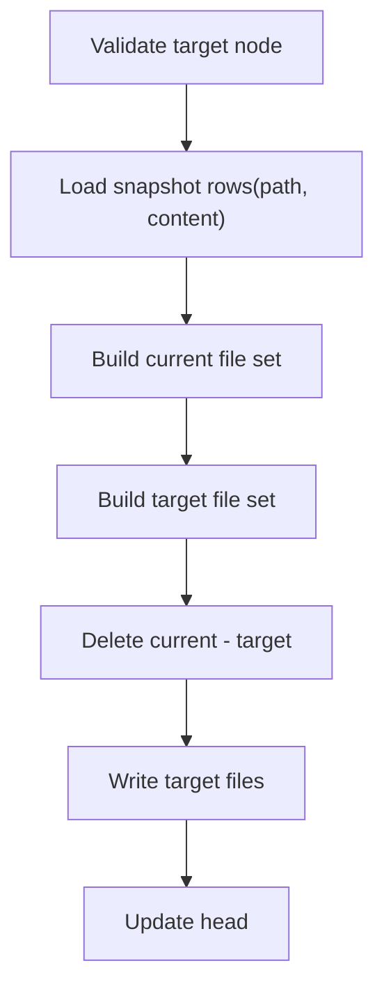

# Novel IDE (Working Title)

소설 집필을 위한 데스크톱 IDE를 목표로 하는 프로젝트다.  
핵심 방향은 다음 3가지다.

- 소설 집필에 최적화된 툴
- Git 기반 그래프형 버전 관리
- VS Code 같은 작업 경험(파일 트리, 탭, 편집기, 소스 컨트롤)

## Vision

일반 메모 앱이 아니라, 집필 흐름(초안 작성, 분기, 비교, 되돌리기)에 맞춘 IDE를 만든다.  
문서 단위 저장을 넘어, 이야기의 분기와 합류를 명시적으로 다룰 수 있어야 한다.

## Core Concepts

- Project: 하나의 소설 작업 단위
- Chapter: 장(큰 구조)
- Scene: 장 안의 세부 단위
- Snapshot: 특정 시점의 저장본(= Commit)
- Branch: 서사 분기(대체 전개, 실험 버전)

## Current Repository Structure

```text
.
├── apps/
│   ├── cli/             # CLI app
│   └── desktop/         # Tauri + React app
├── crates/
│   └── core/            # domain/storage logic
├── Cargo.toml           # Rust workspace
├── package.json         # pnpm workspace scripts
└── pnpm-workspace.yaml
```

## MVP Scope

포함:

- 파일 트리 + 탭 기반 편집
- 자동 저장/수동 저장
- Git commit/branch/checkout
- Commit 그래프 시각화
- Commit 간 diff 확인

제외(초기):

- 실시간 협업
- 클라우드 동기화
- AI 자동 집필/자동 수정

## Architecture Direction

- Frontend: React + Monaco Editor
- Desktop Runtime: Tauri
- Backend(Core): Rust
- Versioning: Git (Rust에서 명령/라이브러리 래핑)
- Metadata: SQLite (프로젝트 메타데이터, UI 상태 등)

## UI Design Reference

Desktop UI는 사용자가 제공한 Stitch 시안(HTML) 기준으로 VS Code 스타일 셸을 타겟으로 한다.

- Activity Bar (좌측 50px)
- Explorer / Source Control Sidebar
- Editor Workspace (Tabs + Breadcrumb + Editor + Minimap)
- Status Bar (하단)

핵심 토큰/레이아웃/컴포넌트 규칙은 아래 문서에 정리했다.

- `docs/design-reference.md`

## VCS Data Model & Flow

현재 `workspace-core` VCS는 "그래프 이력"과 "파일 스냅샷"을 분리해서 저장한다.

- 그래프 이력: `nodes`, `node_parents`, `head`
- 파일 스냅샷: `blobs`, `node_files`



`commit` 동작:

1. 워크스페이스 파일 수집(`.novel` 제외)
2. 각 파일 content 해시로 `blob_id` 계산
3. 트랜잭션 안에서 `nodes`/`node_parents`/`blobs`/`node_files` 기록
4. `head`를 새 노드로 이동



`checkout` 동작:

1. 대상 노드 존재 검증
2. `node_files + blobs` 조인으로 대상 스냅샷 로드
3. 현재 파일 집합과 대상 파일 집합 비교
4. 필요 파일 삭제/복원
5. `head`를 대상 노드로 이동



## Development

Prerequisites:

- Rust toolchain
- Node.js + pnpm
- Tauri prerequisites (OS별)

Install:

```bash
pnpm install
```

Rust workspace check:

```bash
cargo check --workspace
```

Desktop dev:

```bash
pnpm tauri:dev
```

Type check:

```bash
pnpm typecheck
```

CLI test:

```bash
cargo test -p novel-cli
```

## Roadmap (Updated: 2026-02-22)

현재 전략:

- 엔진은 Git-like 그래프 버전관리
- UI는 비개발자 친화 용어 중심(예: Snapshot, Restore)
- 버전 단위는 "소설 본문 + 리서치 + 아이데이션 + 캐릭터/세계관/타임라인" 전체

Phase 1 (Current): Workspace Foundation

- 프로젝트 열기/파일 탐색/읽기/쓰기/파일 생성 안정화
- 기본 저장공간 분리(app data workspace)
- `workspace-core` 파일 연산 테스트 안정화

Phase 2 (Current Next): VCS Core Skeleton

- `init_repo`, `repo_state`, `commit`, `checkout`, `log` 최소 동작 완성
- SQLite migration + schema 버전 관리 고정
- HEAD 이동/기본 노드 그래프 무결성 검증

Phase 3: Snapshot Engine

- 실제 파일 상태 스냅샷 저장(`blobs`, `node_files`)
- 특정 노드 checkout 시 파일 상태 복원
- commit 간 텍스트 diff v1 제공

Phase 4: Writing Domain Layers

- 아티팩트 타입 통합: manuscript/research/ideation/characters/world/timeline
- 스냅샷을 아티팩트 관점으로 필터링/조회
- 복원 전 미리보기 UX

Phase 5: Writer UX + Graph Experience

- 비개발자 용어 중심 히스토리/분기 UX
- 분기 실험(대안 플롯) 생성/비교/병합 UX
- 단축키/검색/명령 팔레트 등 생산성 강화

## License

MIT (see `LICENSE`)
