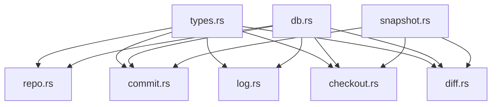

# VCS Refactor Structure

## Goal
- Split `/Users/jogyeong-il/Desktop/Code/Side/rust-playground/novel-cli/crates/workspace-core/src/vcs.rs` into focused modules.
- Keep public API signatures unchanged: `init_repo`, `repo_state`, `commit`, `log`, `checkout`, `diff_nodes`.
- Do file-structure refactor first, then continue feature work.

## Target Tree

```text
/Users/jogyeong-il/Desktop/Code/Side/rust-playground/novel-cli/crates/workspace-core/src/
  vcs/
    mod.rs
    types.rs
    db.rs
    snapshot.rs
    repo.rs
    commit.rs
    log.rs
    checkout.rs
    diff.rs
```

## Module Responsibility

| File | Responsibility |
|---|---|
| `types.rs` | Domain types (`NodeId`, `VersionNode`, `RepoState`, `DiffKind`, `FileDiff`, `NodeDiff`, row structs) |
| `db.rs` | DB path/connection/migrations/error mapping |
| `snapshot.rs` | Workspace file collection, path normalization, blob hash/snapshot helpers |
| `repo.rs` | Repository init/state (`init_repo`, `repo_state`) |
| `commit.rs` | Commit creation and head/parent updates |
| `log.rs` | History query (`log`) |
| `checkout.rs` | Restore workspace snapshot (`checkout`) |
| `diff.rs` | Snapshot compare (`diff_nodes`, unified diff generation) |
| `mod.rs` | Module wiring and re-export |

## Dependency Direction



## `mod.rs` Scaffold

```rust
mod types;
mod db;
mod snapshot;
mod repo;
mod commit;
mod log;
mod checkout;
mod diff;

pub use types::*;
pub use repo::*;
pub use commit::*;
pub use log::*;
pub use checkout::*;
pub use diff::*;
```

## Migration Order
1. Move types to `types.rs`.
2. Move connection/migration helpers to `db.rs`.
3. Move snapshot/file helpers to `snapshot.rs`.
4. Move public APIs in order: `repo.rs` -> `commit.rs` -> `log.rs` -> `checkout.rs` -> `diff.rs`.
5. Update imports/visibility (`pub`, `pub(crate)`).
6. Validate each step with `cargo check -p workspace-core`.
7. Final verify with `cargo test -p workspace-core`.

## Safety Rules
- Move one module at a time.
- Avoid behavior changes during move.
- Keep function signatures stable.
- If build fails, check `use` paths and visibility first.
